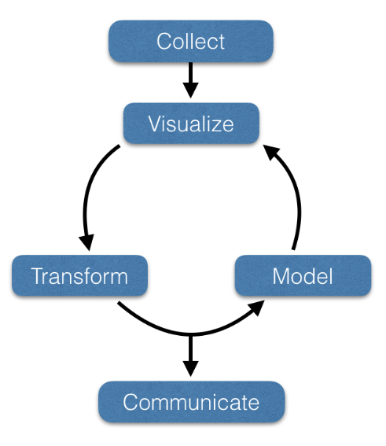

# ENVS 516: Population Genetics

> Semester course; 3 lecture hours. 3 credits. Prerequisite: [STAT/BIOS 543](https://bulletin.vcu.edu/search/?P=STAT%20543). Theoretical and empirical analyses of how demographic and evolutionary processes influence neutral and adaptive genetic variation within populations.

## Introduction
Population genetics is concerned with understanding the mechanisms influencing genetic material's movement through space and time. To understand the operation of evolution itself, you must have a working knowledge of population genetics. It is, so to speak, where the rubber meets the road, and the concepts contained within the field of population genetics have relevance to other sub-disciplines such as population biology, population ecology, evolutionary biology, evolutionary ecology, conservation genetics, landscape genetics, and forensic science.

The field of population genetics has a history punctuated with periods of intense interest interspersed with periods of mind-numbing stagnation. Despite, or perhaps due to, the isochronal development in the theory underlying this field, the foundations laid down by Fisher, Haldane, and Wright during the early decades of the 20th century continue to influence empirical validation.

## Workflows in Population Genetics

To understand data analysis in population genetics, we should recognize a generic iterative workflow, such as the one depicted below.

- _Collect:_ Getting data from an external source into a format you can use is often the most time-consuming step in the analysis. The content of this class will provide training in data import from local, online, and database sources.
- _Visualize:_ Visualizing data is key to understanding. In the image below, notice that the variables X and Y in all the displayed data sets have equivalent means, standard deviations, and correlation up to 2 decimal places! We will emphasize visualization, both static and dynamic, throughout this class.
- _Transform:_ More than pulling data into your analysis ecosystem is required. Often, the data needs to be reformatted and reconfigured before it is actually usable.
- _Model:_ Applying models to subsets of data is often the step that takes the least time and effort. However, applying a model to data is not the endpoint. The model must be visualized, and, often, the underlying data or derivate data must be transformed and submitted to subsequent models.
- _Communicate:_ The effort we put into research and analyses is only possible when we effectively communicate our data and findings to a broad audience. Here, we will focus on developing effective data communication strategies and formats.

## Course Learning Objectives

This course aims to help you develop your data skills and a foundational understanding upon which subsequent courses will build. The overarching goal is to develop a working knowledge of the R statistical computing language and enough proficiency to import raw data and then iterate through the visualization, manipulation, and analysis steps to create output that is easily communicated to a scientific audience.

The content of this course is built upon the following general student learning objectives (SLO):

- **SLO 1:** Identify, manipulate, analyze, and summarize data associated with marker-based genetic data.
- **SLO 2:** Explain and demonstrate how microevolutionary processes impact genetic structure and diversity.
- **SLO 3:** Create graphical and tabular displays of various population genetic data of suitable quality for inclusion in published manuscripts.

## Schedule of Modules

This course has a total of 10 independent learning modules.  Each of these will have content necessary to introduce the concept, some background information on the process/processes, an example manuscript for discussion, a longer narrative document with data and worked examples, an in-class activity for group work, and one or more assessment tools.  

Module  | Topic                                    
--------|------------------------------------------
1       | Background Data Literacy                 
2       | Genetic Variation                        
3       | Inbreeding & Pedigrees                   
4       | Drift & Population Size                  
5       | Mutation                                 
6       | Parentage Analysis & Forensic Genetics   
7       | Gene Flow & Structure                    
8       | Selection                                
9       | Linkage & Recombination                  
10      | The Coalescent Process                   

## Evaluations

